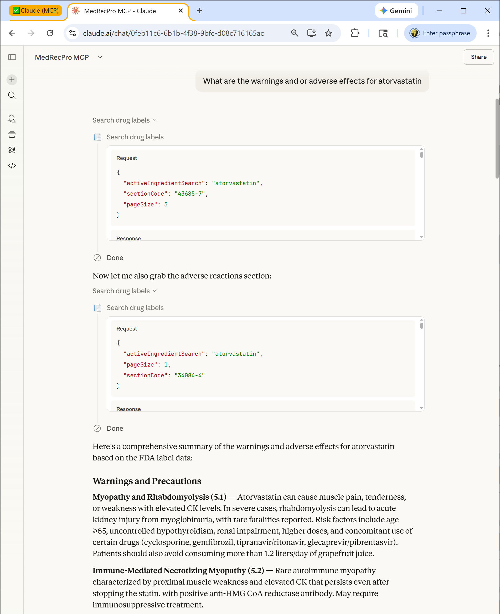
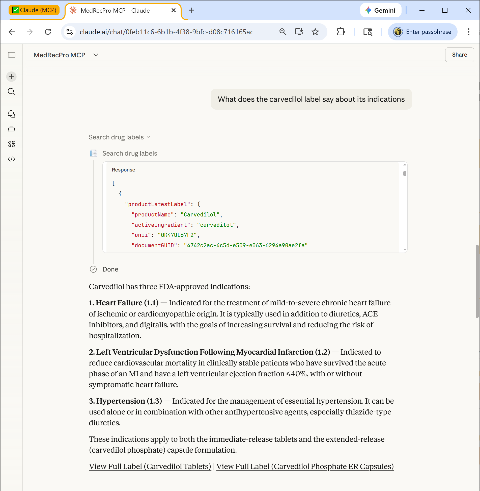
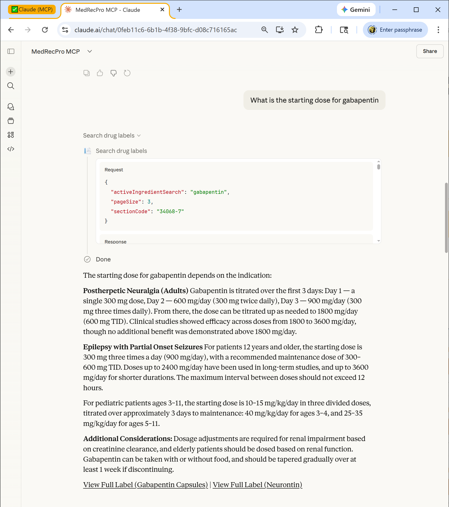
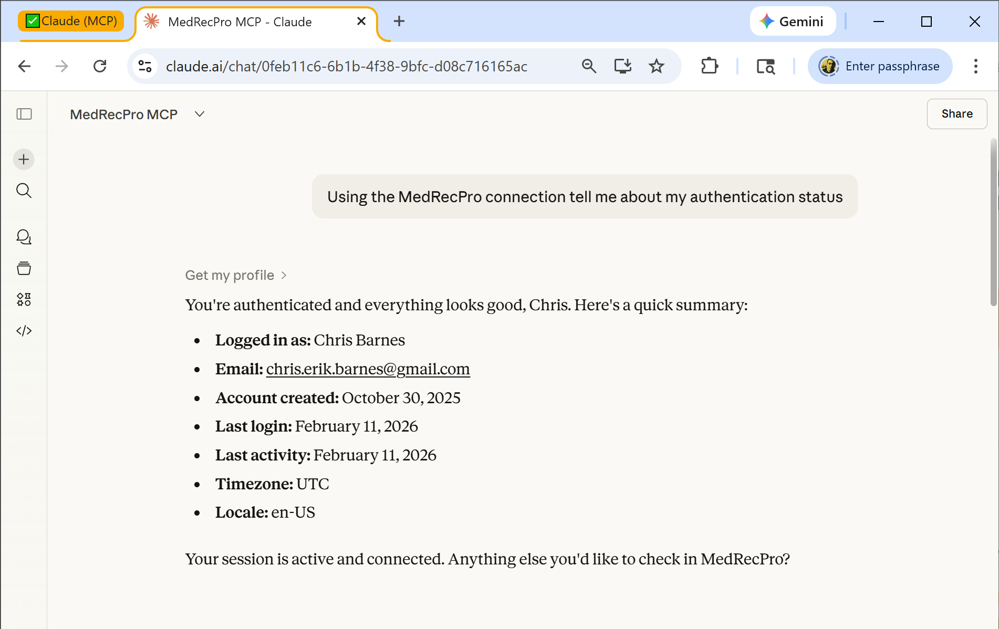

# MedRecPro MCP Server

## Description

MedRecPro connects Claude to the MedRecPro API (https://www.medrecpro.com/api/swagger/index.html). The underlying database is a normalized schema populated from the FDA SPL files hosted at the NIH National Library of Medicine's DailyMed drug label database. The tools provide access to comprehensive FDA-approved drug label information, delivering a traceable source of truth. Ask Claude about any medication — side effects, dosage, warnings, drug interactions, indications — and get accurate, sourced answers pulled directly from official Structured Product Labeling (SPL) data. Every response includes a direct link to the official FDA label for source verification.

## Features

- **Search by brand or generic name:** Ask about "Lipitor" or "atorvastatin" and get the same comprehensive results. Supports partial matching and UNII chemical identifiers.
- **Targeted label section lookups:** Get specific sections like warnings, adverse reactions, dosage, drug interactions, or indications without wading through the full label. Claude automatically selects the right LOINC section code.
- **Drug comparisons:** Compare warnings, side effects, or indications across multiple medications. Claude calls the search tool for each drug and synthesizes a side-by-side comparison.
- **Complete label export:** Export any FDA drug label as clean, formatted markdown with all sections — indications, dosage, warnings, adverse reactions, clinical pharmacology, and more.
- **FDA source verification:** Every response includes a clickable link to view the official FDA label, so you can verify the information directly.
- **User activity tracking:** View your MedRecPro profile and search history to keep track of your research sessions. This feature requires authentication. The drug tools function with anonymous access. 

## Setup

1. Visit the [Anthropic MCP Directory](https://claude.com/connectors)
2. Find and connect to **MedRecPro**
3. Complete OAuth authentication with your Google or Microsoft account
4. Start asking Claude about medications

## Authentication

This server requires OAuth authentication. You'll need:

- A Google or Microsoft account to sign in
- No special permissions, subscriptions, or account types required
- Authentication uses OAuth 2.1 with PKCE and is handled seamlessly through Claude's connector interface
- New users are automatically provisioned. PII includes the user's email address and name as provided by the OAuth host (Google/Microsoft)

## Examples

### Example 1: Look Up Warnings and Adverse Effects

**User prompt:** "What are the warnings and or adverse effects for atorvastatin"

**What happens:** Claude calls `search_drug_labels` with `activeIngredientSearch: "atorvastatin"` and `sectionCode: "43685-7"` (Warnings and Precautions), then makes a second call with `sectionCode: "34084-4"` (Adverse Reactions) to get both sections.

**Expected output:** Claude presents a comprehensive summary of atorvastatin's warnings and adverse effects from the FDA label, organized by category — myopathy and rhabdomyolysis risks, immune-mediated necrotizing myopathy, liver enzyme considerations, endocrine effects, and CNS effects. Common adverse reactions are listed with their clinical trial incidence rates. A link to view the full FDA label is included.

---

### Example 2: Check Drug Indications

**User prompt:** "What does the carvedilol label say about its indications"

**What happens:** Claude calls `search_drug_labels` with `activeIngredientSearch: "carvedilol"` and `sectionCode: "34067-9"` (Indications and Usage).

**Expected output:** Claude presents carvedilol's three FDA-approved indications: (1) Heart Failure — treatment of mild-to-severe chronic heart failure of ischemic or cardiomyopathic origin, (2) Left Ventricular Dysfunction Following Myocardial Infarction — to reduce cardiovascular mortality in clinically stable patients, and (3) Hypertension — management of essential hypertension. Links to view the full FDA labels for both tablet and extended-release capsule formulations are included.

---

### Example 3: Find Dosage Information

**User prompt:** "What is the starting dose for gabapentin"

**What happens:** Claude calls `search_drug_labels` with `activeIngredientSearch: "gabapentin"` and `sectionCode: "34068-7"` (Dosage and Administration).

**Expected output:** Claude provides detailed gabapentin dosing information by indication — postherpetic neuralgia (titrated over 3 days: Day 1 = 300 mg, Day 2 = 600 mg, Day 3 = 900 mg/day) and epilepsy with partial onset seizures (300 mg three times daily for patients 12+, weight-based dosing for pediatric patients ages 3-11). Includes renal impairment adjustments, maximum doses, tapering guidance, and links to view the full FDA labels.

---

### Example 4: Export a Complete Drug Label

**User prompt:** "Show me the full label for valsartan"

**What happens:** Claude calls `export_drug_label_markdown` with `activeIngredientSearch: "valsartan"` (Step 1 — product search). MedRecPro returns a list of matching products including single-ingredient generics, Diovan (brand), Diovan HCT (combination), Exforge, ENTRESTO, and others. Claude presents the options and asks the user to select one. After the user selects "Diovan (brand)," Claude calls `export_drug_label_markdown` with the selected `documentGuid` (Step 2 — export).

**Expected output:** The complete Diovan (valsartan) FDA drug label rendered as formatted markdown, starting with the product header ("DIOVAN (valsartan) tablets, for oral use"), followed by the boxed warning (Fetal Toxicity), then all label sections — Indications and Usage, Dosage and Administration, Dosage Forms and Strengths, Contraindications, Warnings and Precautions, Adverse Reactions, Drug Interactions, Use in Specific Populations, Overdosage, Description, Clinical Pharmacology, and more. A source link to the official FDA label is included.

---

### Example 5: View Your Authentication and Profile

**User prompt:** "Using the MedRecPro connection tell me about my authentication status"

**What happens:** Claude calls `get_my_profile` to retrieve the current user's MedRecPro account information.

**Expected output:** Claude confirms the connection is active and displays the user's profile: logged-in name, email address, account creation date, last login date, last activity date, timezone, and locale settings.

## Privacy Policy

See our privacy policy: https://www.medrecpro.com/Home/Privacy

## Support

- Email: support@medrecpro.com
- Documentation: https://www.medrecpro.com/mcp/docs
- Getting Started: https://www.medrecpro.com/mcp/getting-started
- Issues: https://github.com/chriserikbarnes/MedRecPro/issues
